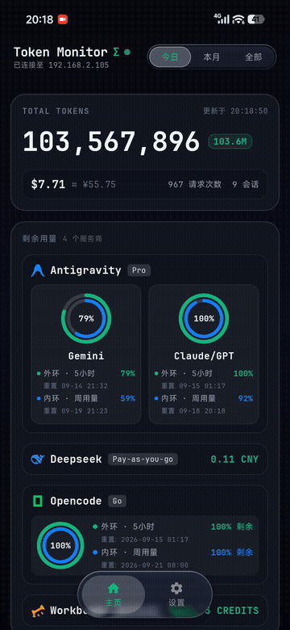
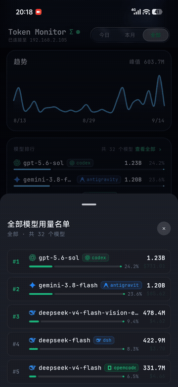
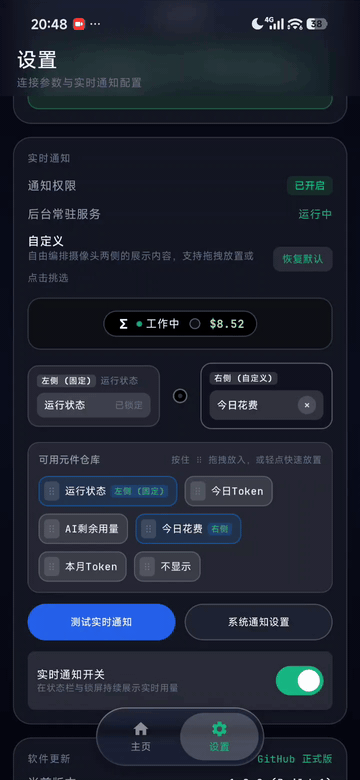
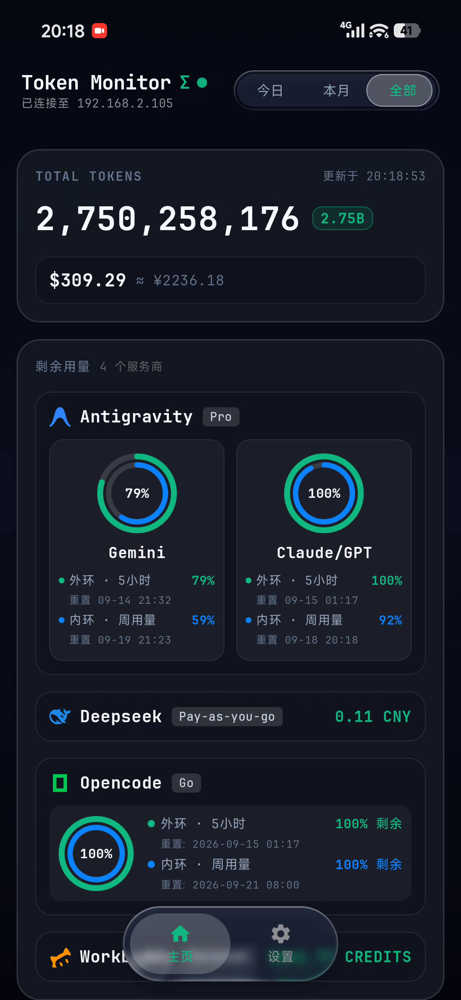
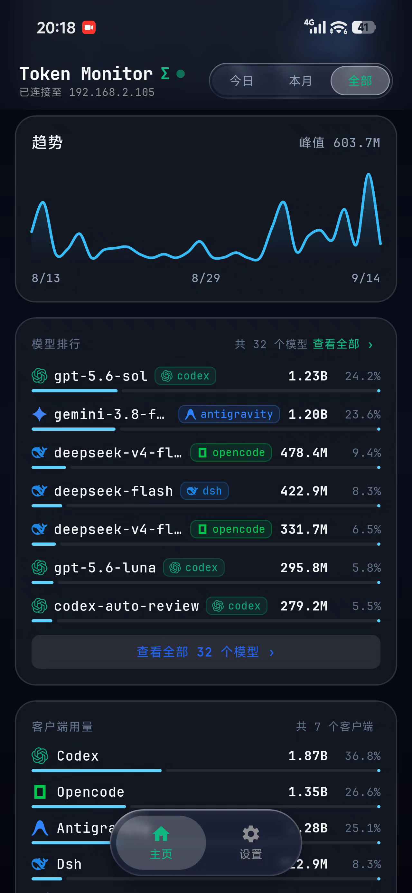
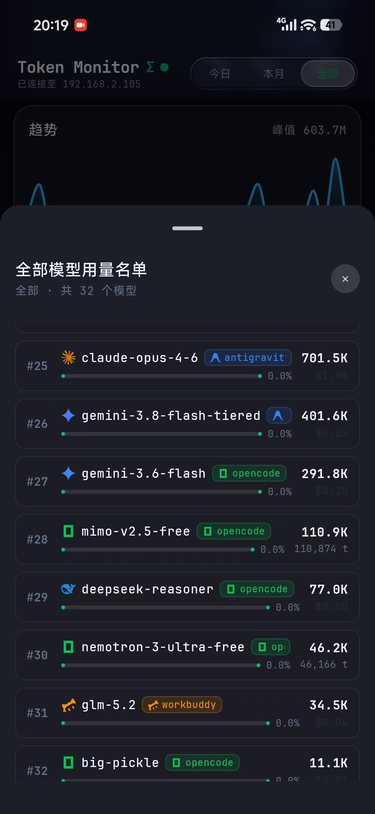
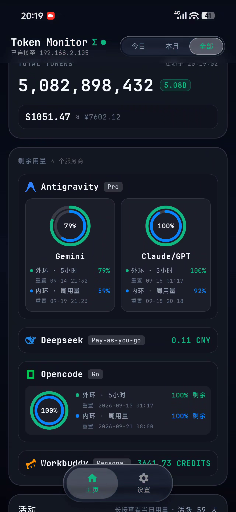
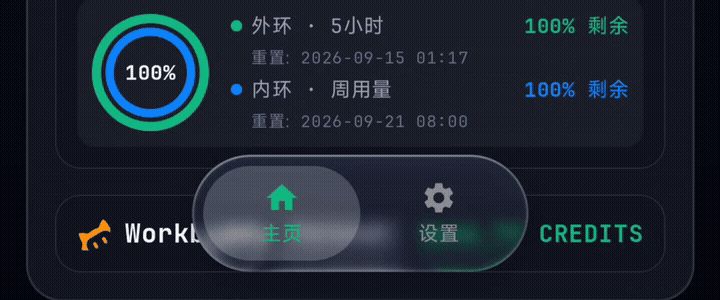
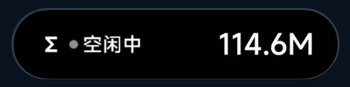
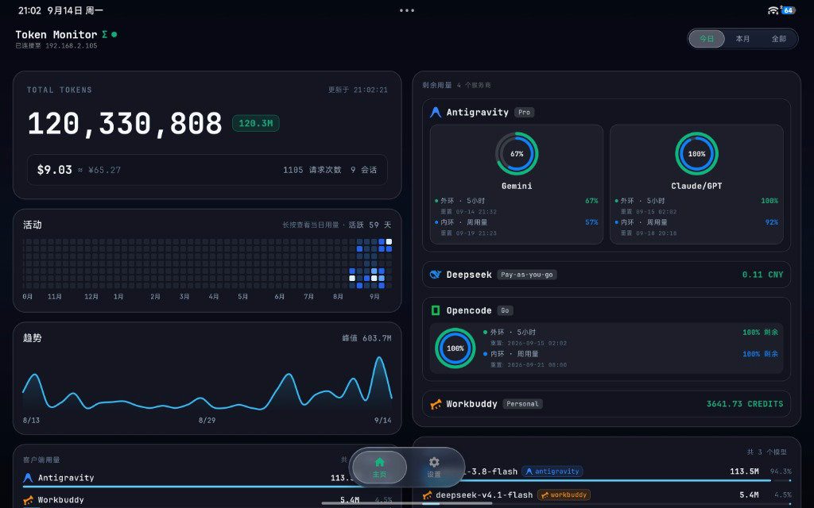

# Token Monitor Android

<p align="center">
  
</p>

<p align="center">
  <strong>A modern, fluid and high-performance native Android client for AI token usage and quota monitoring.</strong>
</p>

<p align="center">
  <a href="https://github.com/hcen229/Token-Monitor-Android/releases"></a>
  
  
  
  
</p>

<p align="center">
  <a href="#-interface--motion-preview">Preview</a> ·
  <a href="#-features">Features</a> ·
  <a href="#-quick-start">Quick Start</a> ·
  <a href="#-build-from-source">Build</a> ·
  <a href="#-faq">FAQ</a>
</p>

<p align="center">
  <a href="./README.md">简体中文</a> · <strong>English</strong>
</p>

---

## 📖 Overview

**Token Monitor Android** is a native mobile companion app built for the [Token Monitor](https://github.com/Javis603/token-monitor) desktop client.

Over a direct peer-to-peer LAN connection, it streams the **token consumption, estimated cost, request statistics, per-model usage share and remaining provider quota** of your desktop AI coding tools (Cursor, Cline, Trae, Copilot, etc.) and mainstream models (DeepSeek, Claude, OpenAI, Gemini, Qwen, Kimi, Doubao and more) to your phone in real time, and keeps them visible through a **status bar capsule, live notifications and an ongoing status bar entry**.

> **In one line**: without interrupting whatever you are doing on your phone, a single glance tells you the usage and progress of the AI running on your computer.

---

## 📱 Interface & Motion Preview

<p align="center">
  
  
  
</p>

<p align="center">
  <em>Fig 1: Multi-dimensional Dashboard · Fig 2: Models Leaderboard & Drawer · Fig 3: Live Notification Customizer</em>
</p>

<br>

<p align="center">
  
  
  
</p>

<p align="center">
  <em>Fig 4: Dual Concentric Quota Rings · Fig 5: Bézier Trend Charts & Brand Icons · Fig 6: Detailed Model Breakdown Drawer</em>
</p>

<br>

<p align="center">
  
  
</p>

<p align="center">
  <em>Fig 7: GitHub-style 365-Day Activity Contribution Heatmap · Fig 8: Squash & Stretch Liquid Dynamics Slider & Frosted Dock</em>
</p>

<br>

<p align="center">
  
</p>

<p align="center">
  <em>Fig 9: System Status Bar Dynamic Island Live Capsule (Idle ➔ Active Working Breathing Dot & Real-Time Token Sync)</em>
</p>

<br>

<p align="center">
  
</p>

<p align="center">
  <em>Fig 10: Responsive Tablet & Large-Screen Dual-Pane Layout (Left: Metrics Overview & Heatmap · Right: Quotas & Model Breakdown)</em>
</p>

---

## 💡 Why This Exists: Keep Track of AI Tasks While You Scroll

After handing a complex refactor, a batch code generation job or a multi-step agent task to Cursor, Cline, Trae or Claude Code, you typically have to wait anywhere from one to five minutes.

Many users pick up their phone during that window to read the news or reply to messages — while still wondering:

- *"Is the AI actually done yet?"*
- *"Did the network stall, or is it waiting for me to hit Proceed?"*

The result is constantly glancing up and leaning over to check the monitor, which defeats the purpose of taking a break.

**The Token Monitor Android answer**: bring the AI's live pulse straight to your phone's status bar — **no need to switch away from the app you are browsing; the live update at the top of the screen tells you everything.**

| State | Trigger | Meaning |
| :--- | :--- | :--- |
| 🟢 **Working** | Token counter keeps increasing | The desktop AI is generating code or calling tools — relax and keep scrolling |
| ⚪ **Idle** | No change for a full 2 minutes | The task is finished, or it is waiting for your input or next instruction — time to check the result |
| ⚠️ **Offline** | Desktop client exited or the LAN dropped | The connection is down; you are warned immediately instead of waiting for nothing |

---

## 🌟 Design Principles

- **Fully native**: built with **Jetpack Compose + Material 3 + Kotlin 2.0** — no WebView, no cross-platform framework.
- **Broad system compatibility**: targets generic Android 8.0+, supporting the status bar capsules of major vendor skins, punch-hole capsule extensions and the standard Android live notification APIs.
- **Pure local peer-to-peer communication**: data travels only directly between your phone and your computer on the LAN — no cloud dependency, no third-party ads and no tracking SDKs.
- **Battery-aware by design**: adaptive front/background refresh control plus wake-lock guarding keep data fresh while cutting screen-off and background power draw.

---

## ✨ Features

### 1. Monitoring Dashboard & Full Analytics

- **Multi-period usage and cost statistics**: switch freely between "Today", "This Month" and "All Time" to see token consumption, estimated cost, request count and session count.
- **365-day activity heatmap**: a classic GitHub-style 7-row × N-column contribution matrix quantised into 5 usage levels; long-press any cell for a popover with that day's detailed metrics.
- **Smooth Bézier trend charts**: 24-hour and 7-day curves drawn with smooth cubic Bézier paths and a gradient light band, with automatic extreme-point detection and a peak badge.
- **Local model ranking and client distribution**:
  - precise per-model consumption and percentage share;
  - intuitive contribution breakdown across Cursor, Cline, Trae, Copilot and other clients;
  - anything beyond 7 entries is folded into an overview drawer to keep the main screen clean.

### 2. Live Notifications & Dynamic Island

- **Freely customizable capsule layout**: arrange elements on both sides of the front punch-hole camera (runtime status, today's tokens, remaining AI quota, today's cost, monthly tokens, or hidden) via intuitive drag-and-drop or tap placement, with a live WYSIWYG simulator preview.
- **Real-time status bar capsule awareness**: adapts to front punch-hole screens and system status bars, automatically switching between "Idle" and "Working" (with breathing active green dot) while syncing live token counts in real time.
- **Multi-mode quota calculation**: smart auto (picks the tightest limit or the cash balance), 5-hour rolling limits, weekly quota limits and cash balance modes.
- **Automatic work-state detection**: token movement flips the state to "Working"; two minutes without change falls back to "Idle", matching a real development rhythm.

### 3. Provider Quotas & Remaining Balance Visualization

- **20+ official brand vector logos**: DeepSeek, Gemini, Claude, OpenAI/GPT (Codex), Qwen, Kimi (Moonshot), Doubao, MiniMax, Grok, Llama / Mistral / Ollama, Antigravity, OpenCode, WorkBuddy, Cursor, Cline, Copilot, Trae, OpenRouter, Alibaba Cloud and Droid Factory — each with its official vector mark and brand colour.
- **Two visualization styles**: switch freely between "concentric dual rings" and "horizontal progress bars", with configurable inner/outer ring bindings and centre text.
- **Custom card ordering**: long-press and drag to reorder the provider cards.

### 4. Interface Aesthetics & Large-Screen Adaptation

- **Floating liquid-glass bottom bar**: real-time Gaussian blur with physical spring snapping for natural, fluid touch interaction.
- **Frosted progressive top bar**: while scrolling, the top bar transitions into a progressive Gaussian blur and blends seamlessly into the content.
- **Responsive two-column layout**: purpose-built for tablets, foldables, and landscape phones (left: metrics overview, 365-day heatmap, and trends; right: quotas and model breakdown) to make full use of the extra width (see Fig 10).

### 5. Power Efficiency & Long-Lived Connection

- **Adaptive front/background throttling**: fast refresh (3 s by default) while the app is in the foreground, automatically relaxed to 45 s once it is backgrounded or the screen turns off — far fewer wake-ups and connections.
- **Foreground service guarding**: a foreground service (`dataSync` + `specialUse`) plus a `PARTIAL_WAKE_LOCK` keeps synchronisation stable while the screen is locked or the app is in the background.
- **Self-healing state**: after a dropped or interrupted connection the service reconnects and restores state detection automatically, with no manual intervention.

---

## 📱 Compatibility Matrix

| Capability | Supported on | Notes |
| :--- | :--- | :--- |
| App runtime | Android 8.0+ (API 26+) | `minSdk 26` / `targetSdk 34` / `compileSdk 36` |
| Ongoing notification & sync | Android 8.0+ | Foreground service + notification channel |
| Live notifications | Android 16 and above | Uses the official promoted ongoing notification path |
| Super Island / Focus Notification | Xiaomi HyperOS 3-4 | Uses Xiaomi's Focus Notification V3 protocol |
| Other vendor skins | Android 8.0+ | Automatically falls back to a standard ongoing notification |
| Large screens & landscape | Tablets, foldables, landscape phones | Responsive two-column layout |
| Network | LAN only (same Wi-Fi / subnet) | Cross-subnet and public-internet connections are not supported yet |

---

## 🚀 Quick Start

### Prerequisites

1. The [Token Monitor desktop client](https://github.com/Javis603/token-monitor) is installed and running on your computer.
2. Your phone and computer are on the **same LAN** (for example, the same Wi-Fi router).
3. The required port is open in the computer's firewall (default: **17321**).
   *On Windows, right-click `open-firewall.bat` from this repository and run it as administrator to open the port in one step.*

### Steps

1. Install and open Token Monitor on your phone, then swipe the bottom bar to the **Settings** page.
2. Enter your computer's LAN IP (for example `192.168.1.100`) and the shared secret configured in the desktop client.
3. Tap **Save Configuration**, then tap **Check Connection** to verify connectivity.
4. Once the check passes, go back to the **Live Monitor** dashboard to see your synchronised token data.
5. Configure the capsule slots and enable notifications on the Settings page, then swipe up to return to the home screen and keep watching usage from the status bar.

---

## 🛠️ Build From Source

### Requirements

- JDK 17+
- Android SDK (`compileSdk 36`, `minSdk 26`, `build-tools 36.1.0`)

### Commands

```powershell
# Windows PowerShell: one-shot release build, signing and verification
powershell -ExecutionPolicy Bypass -File .\build-apk.ps1
```

```cmd
:: Windows CMD one-shot build
.\build-apk.bat
```

```bash
# Using the Gradle wrapper
./gradlew assembleDebug      # Build the debug APK
./gradlew assembleRelease    # Build the release APK
```

When the build finishes, the signed release APK is written to the project root as `TokenMonitor.apk`.

---

## 📁 Project Structure

```text
Token-Monitor-Android/
├── app/src/main/
│   ├── AndroidManifest.xml                 # Permissions, service declarations and app metadata
│   └── java/com/tokenmonitor/app/
│       ├── MainActivity.kt                 # Entry point: immersive UI and permission handling
│       ├── TokenMonitorApp.kt              # Application singleton; sets up the global notification channel
│       ├── data/
│       │   ├── Models.kt                   # Data models (TokenStats, Quota, ClientStat, ...)
│       │   ├── IslandConfig.kt             # Status bar capsule and slot configuration models
│       │   └── TokenRepository.kt          # LAN transport, persistence and the two-stage diagnostics engine
│       ├── service/
│       │   ├── ScreenStateManager.kt       # Screen off / on state observer
│       │   ├── TokenMonitorService.kt      # Foreground long-lived service (adaptive power throttling)
│       │   └── TokenNotificationManager.kt # Status bar notification and capsule dispatcher
│       ├── ui/
│       │   ├── HomeScreen.kt               # Monitoring dashboard (hero card, rolling counter, large-screen layout)
│       │   ├── SettingsScreen.kt           # Settings (configuration, network diagnostics, open-source credits)
│       │   ├── MainViewModel.kt            # Core ViewModel
│       │   ├── ActivityTrendCharts.kt      # Activity heatmap and trend chart components
│       │   ├── BrandIcon.kt                # Official AI brand vector icons and colour system
│       │   ├── components/
│       │   │   └── SuperIslandStudio.kt    # Capsule studio (1:1 preview cabin, drag & drop placement)
│       │   ├── glass/                      # Liquid glass materials and sliding controls
│       │   └── theme/                      # Theme colours and typography
│       ├── update/                         # In-app OTA update module
│       └── util/
│           └── CrashHandler.kt             # Global uncaught-exception handler
├── build-apk.ps1                           # One-shot release build script (PowerShell)
├── build-apk.bat                           # One-shot build batch script (CMD)
├── open-firewall.bat                       # One-click firewall rule for port 17321
├── docs/images/                            # Documentation screenshots and motion GIFs
├── PROJECT_MANUAL.md                       # Full project handbook (architecture and protocol details)
├── README.en.md                            # English documentation
└── README.md                               # Simplified Chinese documentation
```

---

## 🔒 Privacy & Security

- **Pure LAN peer-to-peer**: all data flows directly between your phone and your computer; no external server is involved.
- **No analytics or tracking SDKs**: no ads, telemetry or behavioural tracking components are bundled.
- **Secret-based authentication**: every API request is authenticated with a shared secret, blocking unauthorised access from within the LAN.
- **Least privilege**: only notification, network state, foreground service and wake-lock permissions are requested — no access to contacts, location or photos.

---

## 🗺️ Roadmap

- [ ] **Android home screen widget**: check today's usage and quotas right from the home screen without opening the app.
- [ ] **Low-quota and abnormal-usage alerts**: proactive notifications when a provider's remaining quota runs low (for example below 20%) or daily consumption spikes.
- [ ] **Standalone provider usage**: let the phone query some providers' remaining quota APIs directly, without the desktop client.

---

## ❓ FAQ

### Q1: The connection check reports a TCP port timeout

1. Make sure the phone and computer are on the same Wi-Fi LAN and that the router has not enabled "AP isolation".
2. Make sure the IP you entered is the computer's current LAN IPv4 address.
3. Make sure port 17321 is open in the computer's firewall (run `open-firewall.bat` from this repository).

### Q2: Why is the status bar capsule not visible while the app is in the foreground?

To avoid conflicts with the foreground UI's touch targets and title bar, most vendor skins deliberately suppress this app's capsule while the app is active in the foreground. Swipe up to the home screen, lock the screen or switch to another app and the capsule expands naturally.

### Q3: The status bar stops updating after the screen has been off for a while

In your phone's system settings under "App management", set Token Monitor's battery optimisation to **Unrestricted** (or "Don't optimise"), and allow it to auto-start in the background, so the system does not kill the background sync service.

### Q4: There is no notification category listed in the system notification settings

Some systems hide the notification category list until the app has actually posted a notification. Trigger a notification (or send a test notification) from the app's Settings page first; the category then appears in the system settings.

---

## 🙏 Credits & Open-Source References

- **Desktop core**: [Javis603/token-monitor](https://github.com/Javis603/token-monitor) — an excellent desktop AI token monitoring tool and Hub protocol (MIT)
- **Blur components**: [kyant0/backdrop](https://github.com/kyant0/backdrop) — hardware-level AGSL liquid glass blur engine (Apache-2.0)
- **Open-source font**: [JetBrains/JetBrainsMono](https://github.com/JetBrains/JetBrainsMono) — a modern monospaced typeface (OFL 1.1)
- **Upstream data prototype**: [junhoyeo/tokscale](https://github.com/junhoyeo/tokscale) — CLI token tracking and analysis prototype (MIT)
- **Architecture references**:
  - [jizizr/signaldock](https://github.com/jizizr/signaldock) — reference for the punch-hole left/right chamber separation design (MIT)
  - [FrancoGiudans/Capsulyric](https://github.com/FrancoGiudans/Capsulyric) — technical reference for status bar notification capsule interoperability (GPL-3.0)

---

## 📄 License

Released under the [MIT License](./LICENSE).

Copyright © 2026 Token Monitor Contributors
